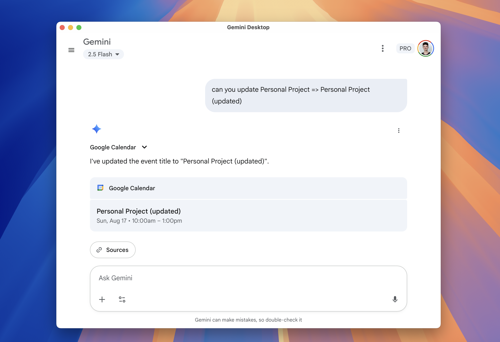

# Gemini Desktop 🤖

A beautiful, lightweight desktop app that provides quick access to Google Gemini AI from your system tray.


## ✨ Features

- 🚀 **Quick Access**: One-click access to Gemini from your system tray
- 💡 **Always Available**: Stays in your system tray for instant AI assistance
- 🎨 **Beautiful Interface**: Clean, modern design with gradient backgrounds
- 🔒 **Secure**: Opens Gemini in your default browser for full security
- ⚡ **Lightweight**: Minimal resource usage when minimized
- 🖥️ **Cross-Platform**: Built with Tauri for native performance

## 🖼️ Screenshots

### Main Interface


### System Tray Integration


### Gemini Launch


## 📥 Download & Installation

### Option 1: Download DMG (Recommended)
1. Download the latest `Gemini Desktop.dmg` from the [Releases](../../releases) page
2. Double-click the DMG file to mount it
3. Drag **Gemini Desktop** to your **Applications** folder
4. Launch from Applications or Spotlight search

### Option 2: Build from Source
See [Building from Source](#-building-from-source) section below.

## 🚀 Usage

### First Launch
1. **Launch the app** from Applications or Spotlight
2. Look for the blue **"G"** icon in your **system tray** (menu bar)
3. **Click the tray icon** to show the Gemini Desktop window

### Daily Usage
- **Left-click** the tray icon to show/hide the window
- **Right-click** the tray icon for menu options (Show, Hide, Quit)
- **Click "Open Gemini"** to launch Gemini in your browser
- **Close the window** to hide it back to the tray (app stays running)

### Features Overview
| Feature | Description |
|---------|-------------|
| 🎯 **Quick Launch** | Click "Open Gemini" to instantly access Google Gemini |
| 📌 **System Tray** | Always available in your menu bar |
| 🔄 **Show/Hide** | Toggle window visibility with tray clicks |
| 🌐 **Browser Integration** | Opens Gemini securely in your default browser |
| ⚙️ **Menu Options** | Right-click tray for additional controls |

## 🛠️ Building from Source

### Prerequisites
- [Rust](https://rustup.rs/) (latest stable)
- [Node.js](https://nodejs.org/) (v16 or later)
- [Tauri CLI](https://tauri.app/v1/guides/getting-started/prerequisites/)

### Installation Steps
```bash
# Clone the repository
git clone https://github.com/yourusername/gemini-desktop.git
cd gemini-desktop

# Install dependencies
npm install

# Install Tauri CLI (if not already installed)
cargo install tauri-cli

# Run in development mode
cargo tauri dev

# Build for production
cargo tauri build
```

### Build Output
After building, you'll find the app in:
- **macOS**: `src-tauri/target/release/bundle/macos/Gemini Desktop.app`
- **DMG Installer**: `src-tauri/target/release/bundle/dmg/Gemini Desktop_1.0.0_aarch64.dmg`

## 🏗️ Project Structure

```
gemini-desktop/
├── src/                    # Frontend source
│   └── index.html         # Main interface
├── src-tauri/             # Tauri backend
│   ├── src/
│   │   └── main.rs        # Rust application logic
│   ├── icons/             # App icons (all formats)
│   ├── Cargo.toml         # Rust dependencies
│   └── tauri.conf.json    # Tauri configuration
├── docs/                  # Documentation
│   └── documentation.md   # Technical documentation
├── screenshots/           # App screenshots
├── implementation.md      # Implementation details
├── package.json          # Node.js dependencies
└── README.md             # This file
```

## ⚙️ Technical Details

### Built With
- **[Tauri](https://tauri.app/)** - Rust-based desktop app framework
- **HTML/CSS/JavaScript** - Frontend interface
- **Rust** - Backend system integration
- **Native APIs** - System tray and window management

### System Requirements
- **macOS**: 10.13 or later
- **Windows**: Windows 10 or later (with build support)
- **Linux**: Most modern distributions (with build support)

### Security
- Opens Gemini in your default browser for full security compliance
- No data storage or collection
- Minimal system permissions required
- Uses your browser's security and authentication

## 🤝 Contributing

We welcome contributions! Here's how you can help:

1. **Fork** the repository
2. **Create** a feature branch (`git checkout -b feature/amazing-feature`)
3. **Commit** your changes (`git commit -m 'Add amazing feature'`)
4. **Push** to the branch (`git push origin feature/amazing-feature`)
5. **Open** a Pull Request

### Development Guidelines
- Follow the existing code style
- Update documentation for new features
- Test thoroughly before submitting
- Follow the [project guidelines](./CLAUDE.md)

## 📝 License

This project is licensed under the MIT License - see the [LICENSE](LICENSE) file for details.

## 🐛 Issues & Support

Found a bug or have a suggestion? Please [open an issue](../../issues) on GitHub.

### Common Issues

**Q: The app doesn't appear in my system tray**  
A: Make sure you've granted the app permission to run. Check System Preferences > Security & Privacy.

**Q: Clicking "Open Gemini" doesn't work**  
A: Ensure you have a default browser set and internet connectivity.

**Q: The app won't start**  
A: Try running from Terminal to see error messages, or reinstall from the DMG.

## 🙏 Acknowledgments

- [Google Gemini](https://gemini.google.com/) for the amazing AI platform
- [Tauri](https://tauri.app/) for the excellent desktop app framework
- [Rust](https://www.rust-lang.org/) community for the powerful programming language

## 📊 Stats


---

<div align="center">
  <strong>Made with ❤️ for the AI community</strong>
  <br>
  <sub>Get instant access to Gemini AI from your desktop!</sub>
</div>